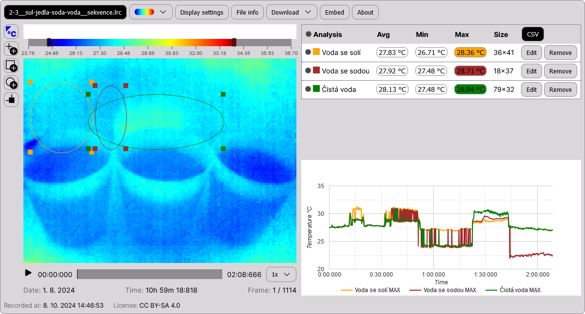

# @labir/embed

A library of webcomponents for thermal imaging in the browser.

[](https://edu.labir.cz/experiment/sul-jedla-soda-a-voda/)

## Overview

The purpose of this library is to enable in-browser display and furher work with LRC files produced by [IR cameras TIMI Edu](https://edu.labir.cz/en/ir-camera/properties-of-our-ir-cameras/). Main usage is currently in STEM education. There is a work-in-progress [Wordpress plugin](/packages/thermal-display) that uses `@labir/embed` for its easy-to-use user interface.

This frontend library is a webcomponents implementation of [@labir/core](/packages/core) which handles all the underlying functionality. The UI is implemented here using [Lit.js](https://lit.dev/).

### Main functions

- load and display LRC images and sequences
- adjust display parameters such as thermal range or colour palette
- inspect temperatures
- create analyses
- export thermal recording to PNG / WEBM
- export analyses data to CSV

## How to use

### 1. Include the library

Include the scripts in the `dist` folder which contains the latest build.

Recommended - use jsdelvr.net. The following code will use the latest production version.

```html
<script src=" https://cdn.jsdelivr.net/npm/@labir/embed/dist/embed.min.js "></script>
<link href=" https://cdn.jsdelivr.net/npm/@labir/embed/dist/embed.min.css " rel="stylesheet">
```

### 2. Use our webcomponents anywhere in the page

See the list of available components and their parameters below. For a simple display of a LRC file, you will probably use one of these webcomponents:

```html
<!-- A simple display of thermal image -->
<thermal-file-app
    url="https://________.lrc"
></thermal-file-app>

<!-- An advanced layout designed for working with analyses -->
<thermal-file-app
    url="https://________.lrc"
></thermal-file-app>

<!-- A drop-in application (you can upload your own LRC files) -->
<thermal-dropin-app></thermal-dropin-app>

```

## Compatibility

All major browsers are supporting custom web components, so this library may be used anywhere. See [the compatibility overview](https://developer.mozilla.org/en-US/docs/Web/API/Window/customElements).

All the included components are fully responsive and they work on mobile devices.

Support of SSR is unknown.

## Performance

On mobile, the following functionality may be slower:
- initial loading
- playback of sequences
- conversion to video

## List of components

There are 3 types of available webcomponents:

1. **top-level applications** which bundle the entire functionality into a single HTML element
2. **provider elements** mirrors core hierarchy from @labir/core
3. **control elememts** displays the visible UI

**You will only use top-level applications** - the three key components:
- `<thermal-file-app></thermal-file-app>`
- `<thermal-file-analyser></thermal-file-analyser>`
- `<thermal-dropin-app></thermal-dropin-app>`

These components are internally built from providers and controls. But you do not need to worry about that.Using the threee components above ensures correct implementation.

In case you want to create a custom layout, styling or if you want to combine our components with other HTML content, you can use providers and controls. But you need to do it correctly. See the examples below or the `/src` folder for more information.


### Single file applications and their parameters

There are two components for displaying a single LRC file: `<thermal-file-app>` and `<thermal-file-analyser>`. They differ in layout, but all their parameters and functionality is the same. All the parameters are listed below. Source: `src/apps/BaseApp.ts`.


```html
<!-- 
    The simpliest usage.
    URL parameter is required.
    All other parameters below are optional.
-->
<thermal-file-app
    url="https://________.lrc"
></thermal-file-app>

<!-- 
    All the parameters below apply to both 
    thermal-file-app and thermal-file-analyser.
-->
<thermal-file-analyser
    url="https://________.lrc"
    visible="optional URL of the corresponding visible image"
    
    label="optional string - displayed in the black button in the header"
    license="optional string - shortcut of the file's license"
    author="optional string - author name"
    recorded="optional string - time of the recording"

    opacity="optional number from 0 to 1; 1 = the visible image is completely transparent"

    from="optional number - temperature range minimum in Celsius"
    to="optional number - temperature range maximum in Celsius"

    palette="optional string - jet / iron / grayscale"

    analysis1="optional definition of an analysis - see the syntax below"
    analysis2="optional definition of an analysis - see the syntax below"
    analysis3="optional definition of an analysis - see the syntax below"
    analysis4="optional definition of an analysis - see the syntax below"
    analysis5="optional definition of an analysis - see the syntax below"
    analysis6="optional definition of an analysis - see the syntax below"
    analysis7="optional definition of an analysis - see the syntax below"

>

    <div>Any HTML content provided inside the webcomponent will be rendered as the description.</div>

</thermal-file-analyser>

```

### Analysis syntax

To set an analysis as a HTML parameter, you can use the following syntax:

Area analysis:

`[name];[rectangle/ellipsis];color:[string];top:[int];left:[int];width:[int];height:[int];[avg?];[min?];[max?]`

Point analysis:

`[name];point;color:[string]top:[int];left:[int];[avg?]`

**Examples:**

A point analysis at X:10 Y:35 with AVG graph on:

`A point analysis;point;top:35;left:10;avg`

A yellow elliptical analysis with MIN graph on:

`An ellipsis;ellipsis;color:yellow;top:10;left:10;width:100;height:100;min`

Color may be any CSS color notation. If missing, the color will be assigned automatically.

Dimensions might be modified if they are larger than the actual size of the LRC image.

The second parameter "ellipsis/rectangle/point" is applied only upon analysis creation and its change will be ignored. But all other parameters change will modify the analysis - i.e. you can use JS to change the analysis name in the parameter and the application will do that.

### Provider components

The underlying hierarchy from [@labir/core](/packages/core) is mirrored to webcomponents using 4 provider elements. Providers do not display anything on their own - you will need to insert controls inside. But providers are necessary since they:

1. build internal structure of @labir/core
2. expose it as Lit.js context that will be used by nested controls

The providers need to be used in the following tree - otherwise the app will crash.

```html

<manager-provider
    slug="optional string - internal ID of ThermalManager object"
    palette="optional string - jet / iron / grayscale"
    smooth="optional boolean - control image smoothing. Default: false"
    graphsmooth="optional boolean - control smooth lines of graphs"
>

    <!-- Manager controls may be here -->

    <!-- Any HTML may be here -->

    <registry-provider
        slug="required string - internal ID of ThermalRegistry object"
        opacity="optional number from 0 to 1 - opacity of visible images"
        from="optional number - thermal range minimum in Celsius"
        max="optional number - thermal range maximum in Celsius"
    >

        <!-- Registry controls may be here -->
        <!-- Manager controls may be here -->

        <!-- Any HTML may be here -->

        <group-provider
            slug="required string - internal ID of ThermalGroup object"
        >

            <!-- Group controls may be here -->
            <!-- Registry controls may be here -->
            <!-- Manager controls may be here -->

            <!-- Any HTML may be here -->

            <!-- There are two types of file providers: a preloaded 
                 image or a dropin. Both of them may contain file controls.
            -->


            <!-- A preloaded file provider-->
            <file-provider
                thermal="https:// required URL ot the LRC file"
                visible="optional URL of the corresponding visible image"
                
                analysis1="optional string using analysis syntax"
                analysis2="optional string using analysis syntax"
                analysis3="optional string using analysis syntax"
                analysis4="optional string using analysis syntax"
                analysis5="optional string using analysis syntax"
                analysis6="optional string using analysis syntax"
                analysis7="optional string using analysis syntax"

            >
            
                <!-- File controls may be here -->
                <!-- Group controls may be here -->
                <!-- Registry controls may be here -->
                <!-- Manager controls may be here -->
            
            </file-provider>

            <!-- A dropped-in file provider -->
            <file-dropin>

                <!-- File controls may be here -->
                <!-- Group controls may be here -->
                <!-- Registry controls may be here -->
                <!-- Manager controls may be here -->

            </file-dropin>

        </group-provider>

    </registry-provider>

</manager-provider>

```

### Controls

Control elements need to be nested properly inside providers.

**Controls do not have any parameters on their own!** Their current state is projected up to the corresponsing provider. Example:

```html

<registry-provider palette="iron">
    <!-- 
         Any changes that user does with the registry-palette-dropdown will 
         modify the registry-provider parameter 'palette'.
         The parameters of the control itself remain unchanged.
     -->
    <registry-palette-dropdown></registry-palette-dropdown>
</registry-provider>

```

#### List of key controls:

```html

<manager-provider>

    <manager-graph-smooth-switch></manager-graph-smooth-switch>
    <manager-smooth-switch></manager-smooth-switch>

    <registry-provider>

        <registry-palette-dropdown></registry-palette-dropdown>
        <registry-palette-buttons></registry-palette-buttons>
        <registry-range-full-button></registry-range-full-button>
        <registry-range-auto-button></registry-range-auto-button>
        <registry-range-slider></registry-range-slider>
        <registry-ticks-bar></registry-ticks-bar>
        <registry-opacity-slider></registry-opacity-slider>
        <registry-histogram></registry-histogram>


        <group-provider>

            <group-tool-buttons></group-tool-buttons>
            <group-tool-bar></group-tool-bar>

            <file-provider>

                <file-canvas></file-canvas>
                <file-timeline></file-timeline>
                <file-playback-speed-dropdown></file-playback-speed-dropdown>
                <file-playback-button></file-playback-button>
                <file-info-button></file-info-button>
                <file-download-dropdown></file-download-dropdown>
                <file-analysis-table></file-analysis-table>
                <file-analysis-graph></file-analysis-graph>

            </file-provider>

        </group-provider>

    </registry-provider>

</manager-provider>

```

## Full list of webcomponents

- thermal-file-app
- thermal-file-analyser
- thermal-dropin-app
- manager-provider
- manager-graph-smooth-switch
- manager-smooth-switch
- registry-provider
- registry-palette-dropdown
- registry-palette-buttons
- registry-range-full-button
- registry-range-auto-button
- registry-range-slider
- registry-ticks-bar
- registry-opacity-slider
- registry-histogram
- group-provider
- group-tool-buttons
- group-tool-bar
- group-dropin
- file-provider
- file-canvas
- file-timeline
- file-playback-speed-dropdown
- file-playback-button
- file-info-button
- file-download-dropdown
- file-video
- file-share-button
- file-marks-content
- file-marker
- file-marker-timeline
- file-analysis-table
- file-analysis-table-row
- file-analysis-graph
- analysis-name
- analysis-color
- edit-area
- edit-point