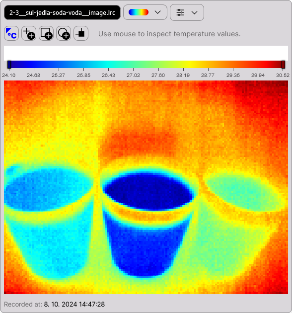

# @labir/embed

A library of webcomponents for thermal imaging in the browser.



## How to use

### 1. Include the library

Include the scripts in the `dist` folder which contains the latest build.

Recommended - use jsdelvr.net. The following code will use the latest production version.

```html
<script src=" https://cdn.jsdelivr.net/npm/@labir/embed/dist/embed.min.js "></script>
<link href=" https://cdn.jsdelivr.net/npm/@labir/embed/dist/embed.min.css " rel="stylesheet">
```

### 2. Use our webcomponents anywhere in the page

See the list of available components and their parameters below. For a simple display of a LRC file, you will probably use one of these webcomponents:

```html
<!-- A simple display of thermal image -->
<thermal-file-app
    url="https://________.lrc"
></thermal-file-app>

<!-- An advanced layout designed for working with analyses -->
<thermal-file-app
    url="https://________.lrc"
></thermal-file-app>

<!-- A drop-in application (you can upload your own LRC files) -->
<thermal-dropin-app></thermal-dropin-app>

```

## List of available components and their parameters

```html
<!-- A simple display of thermal image -->
<thermal-file-app
    url="https://________.lrc"
></thermal-file-app>

<!-- An advanced layout designed for working with analyses -->
<thermal-file-app
    url="https://________.lrc"
></thermal-file-app>

<!-- A drop-in application (you can upload your own LRC files) -->
<thermal-dropin-app></thermal-dropin-app>

```