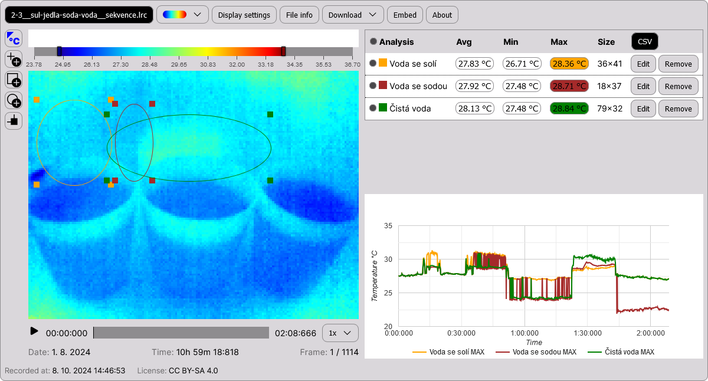

# @labir/embed

A library of webcomponents for thermal imaging in the browser.

[](https://edu.labir.cz/experiment/sul-jedla-soda-a-voda/)

## Demos

- [An advanced view with predefined analyses](https://edu.labir.cz/experiment/sul-jedla-soda-a-voda/)
- [A custom implementation integrated into other HTML content](https://edu.labir.cz/obsah/navody/nastaveni-a-funkce/teplotni-rozsah/)

## Overview

The purpose of this library is to enable in-browser display and furher work with LRC files produced by [IR cameras TIMI Edu](https://edu.labir.cz/en/ir-camera/properties-of-our-ir-cameras/). Main usage is currently in STEM education. There is a work-in-progress [Wordpress plugin](/packages/thermal-display) that uses `@labir/embed` for its easy-to-use user interface.

This frontend library is a webcomponents implementation of [@labir/core](/packages/core) which handles all the underlying functionality. The UI is implemented here using [Lit.js](https://lit.dev/).

### Main functions

- load and display LRC images and sequences
- adjust display parameters such as thermal range or colour palette
- inspect temperatures
- create analyses
- export thermal recording to PNG / WEBM
- export analyses data to CSV

### Registry range slider

`registry-range-slider` renders its track, palette and two accessible handles
directly in Lit, without a third-party slider. Registry contexts supply the
confirmed bounds and range; changes from the range form, full/automatic range
buttons or application code update the handles without writing back to the registry.

Mouse, touch and pen dragging preview the range locally and commit it on release.
Cancelling a gesture or receiving an external range/bounds update discards the preview.
Focused handles move left/right by 1% of the full temperature interval and commit
immediately, updating the registry, form and thermal image. Up/Home selects the
lowest allowed value, Down/End the highest; the mouse wheel also steps by 1%.
Handles cannot cross, and displayed values are rounded to two decimal places
without rounding incoming registry values. A constant temperature interval is
displayed with disabled handles.

The track defaults to **15px** in CSS. Handles are always **5px taller** than
the track and remain vertically centred. Set the track height using an attribute,
ordinary CSS (including inline styles), or the public CSS custom property:

```html
<registry-range-slider height="30px"></registry-range-slider>
<registry-range-slider style="height: 30px"></registry-range-slider>
<registry-range-slider style="--thermal-range-slider-height: 30px"></registry-range-slider>
```

Ordinary CSS `height` overrides the component's default height rule. Otherwise,
the `height` attribute takes precedence over `--thermal-range-slider-height`,
which falls back to 15px. The custom property can also be inherited from a parent
or set in a stylesheet. Attribute changes are reactive; removing or emptying the
attribute restores the CSS fallback without overwriting other inline styles.
Invalid attribute values are logged and also restore the fallback.

Use CSS lengths or expressions such as `2rem`, `calc(1rem + 5px)` or
`var(--custom-height)`, not unitless numbers such as `height="30"`.
Percentage heights require a containing block with a definite height.
Intrinsic sizing keywords such as `auto` are not supported by the attribute.
The loading placeholder follows the configured track height, and tooltips and
the component's reserved space adjust with it. Height changes do not change
the selected temperature range.

### Drop-in file listing layouts

The drop-in app's grid/table switch keeps the same file providers, canvases,
timelines and analysis components mounted. It changes the listing's
`data-layout` attribute; CSS Grid handles the arrangement.

Grid cards show the header, canvas, analyses and timeline in that order.
Cards use their natural height instead of stretching to the tallest neighbour,
so the white background ends with each card's visible content.

Table rows have an unpadded media column (canvas and timeline) and
a white details column (header, analyses and active graphs). The media sets
the row height; longer details scroll within that height. Set
the table-view preview-width slider to choose 20% to 80% of the row width,
in 1% steps (default 50%). Grid view instead shows the column-count slider.
Both settings are retained when switching layouts. Width changes are not animated.

Listing analyses use separate `file-analysis-table` and `file-analysis-graph`
components. Tables size naturally. `file-analysis-graph standalone="true"`
hides itself when no sequence graph is active and measures its own display
size. Active standalone graphs use `--thermal-analysis-graph-height` (default
`12rem`). The existing detail layout using `file-analysis-complex` is unchanged.
Resize observers can still update timeline ticks and graphs when their display
size changes; layout switching does not recreate the thermal canvas.

### Analysis table

`file-analysis-table` renders the analyses of its enclosing file provider. Both
layouts use the same rows and display AVG, MIN and MAX in that order:

```html
<file-analysis-table table-mode="full" show-range-propagator="true"></file-analysis-table>
<file-analysis-table table-mode="compact" show-range-propagator="false"></file-analysis-table>
```

| Attribute | Default | Meaning |
| --- | --- | --- |
| `table-mode` | `full` | `full` has size and action columns; `compact` omits size and places smaller action buttons next to the name. |
| `show-range-propagator` | Inherited interactivity | Show the button that applies the analysis MIN/MAX to the registry range, independently of selection and editing. |
| `selection-enabled` | Inherited interactivity | Allow individual selection and select/deselect all. |
| `edit-enabled` | Inherited interactivity | Show editing and deletion actions. |
| `graph-activation-enabled` | `true` | Allow graph toggles for sequences; points only support AVG. |

Boolean attributes accept `"true"` and `"false"` (an empty attribute enables
the option). Omitting or removing the optional overrides restores inherited
interactivity. Selection, editing, and range propagation default to the
inherited `interactiveanalysis` context or the `forceinteractiveanalysis`
override; `selection-enabled`, `edit-enabled`, and `show-range-propagator` can
override those individually. `table-mode` only changes layout: `full` does not
make the table interactive, and `compact` does not disable interactions.
Graph activation is separately controlled by `graph-activation-enabled`
(enabled by default), and only applies to sequences and supported analysis
types. Range propagation is unavailable for points and disabled until the
analysis has finite, ordered MIN/MAX values.
Hovering or focusing a row highlights its current range in either layout.
Inactive value buttons have transparent backgrounds. Active value buttons use
the analysis color, with black or white text chosen for the higher WCAG contrast;
the same colors apply on hover and focus.
The table fills its container when the content fits. Wider content retains its
natural column widths and scrolls horizontally inside the table's focusable
container, without widening the surrounding grid or flex layout.

`file-analysis-overview` and `file-analysis-overview-row` remain deprecated
compact-layout aliases without a range button by default. The original
misspelled `file-analysis-oveerview` tag remains supported as well.
`file-analysis-display`, used by video export, is unchanged.

## How to use

### Group analysis attribute binding

Custom group hosts can opt into `GroupAnalysisSyncController`. Merge its
`HOST_PROPERTIES` into the element's Lit properties, provide a `groupController`,
initialize `groupAnalysisSyncOn` to `false`, and forward `updated(changed)` to
`hostUpdatedWatcher(changed)`. Construct it after the group controller.

When enabled, `analysis1` through `analysis7` reflect the active file's slot
changes, and host property/attribute changes update the corresponding slots in
all mounted group files. New or remounted files receive the latest host snapshot
on mount. Empty values delete slots; analyses without slots are preserved.
On initial activation, nonempty host analyses take precedence, otherwise the
current pointer (or a file with slots) supplies the snapshot.

The exported `groupAnalysisSyncContext` publishes the enabled state. The host
flag and core group sync switch are synchronized in both directions. Disabling
retains the host snapshot and file analyses but stops the binding; disconnecting
removes listeners without switching off a shared group's core synchronization.
File attribute binding is not automatically disabled: do not give both bindings
ownership of the same host's `analysis1` through `analysis7`.

### 1. Include the library

Include the scripts in the `dist` folder which contains the latest build.

Recommended - use jsdelvr.net. The following code will use the latest production version.

```html
<script src=" https://cdn.jsdelivr.net/npm/@labir/embed/dist/embed.min.js "></script>
<link href=" https://cdn.jsdelivr.net/npm/@labir/embed/dist/embed.min.css " rel="stylesheet">
```

### 2. Use our webcomponents anywhere in the page

See the list of available components and their parameters below. For a simple display of a LRC file, you will probably use one of these webcomponents:

```html
<!-- A simple display of thermal image -->
<thermal-file-app
    url="https://________.lrc"
></thermal-file-app>

<!-- An advanced layout designed for working with analyses -->
<thermal-file-app
    url="https://________.lrc"
></thermal-file-app>

<!-- A drop-in application (you can upload your own LRC files) -->
<thermal-dropin-app></thermal-dropin-app>

```

## Compatibility

All major browsers are supporting custom web components, so this library may be used anywhere. See [the compatibility overview](https://developer.mozilla.org/en-US/docs/Web/API/Window/customElements).

All the included components are fully responsive and they work on mobile devices.

Support of SSR is unknown.

## Performance

On mobile, the following functionality may be slower:
- initial loading
- playback of sequences
- conversion to video

## List of components

There are 3 types of available webcomponents:

1. **top-level applications** which bundle the entire functionality into a single HTML element
2. **provider elements** mirrors core hierarchy from @labir/core
3. **control elememts** displays the visible UI

**You will only use top-level applications** - the three key components:
- `<thermal-file-app></thermal-file-app>`
- `<thermal-file-analyser></thermal-file-analyser>`
- `<thermal-dropin-app></thermal-dropin-app>`

These components are internally built from providers and controls. But you do not need to worry about that.Using the threee components above ensures correct implementation.

In case you want to create a custom layout, styling or if you want to combine our components with other HTML content, you can use providers and controls. But you need to do it correctly. See the examples below or the `/src` folder for more information.


### Single file applications and their parameters

There are two components for displaying a single LRC file: `<thermal-file-app>` and `<thermal-file-analyser>`. They differ in layout, but all their parameters and functionality is the same. All the parameters are listed below. Source: `src/apps/BaseApp.ts`.


```html
<!-- 
    The simpliest usage.
    URL parameter is required.
    All other parameters below are optional.
-->
<thermal-file-app
    url="https://________.lrc"
></thermal-file-app>

<!-- 
    All the parameters below apply to both 
    thermal-file-app and thermal-file-analyser.
-->
<thermal-file-analyser
    url="https://________.lrc"
    visible="optional URL of the corresponding visible image"
    
    label="optional string - displayed in the black button in the header"
    license="optional string - shortcut of the file's license"
    author="optional string - author name"
    recorded="optional string - time of the recording"

    opacity="optional number from 0 to 1; 1 = the visible image is completely transparent"

    from="optional number - temperature range minimum in Celsius"
    to="optional number - temperature range maximum in Celsius"

    palette="optional string - jet / iron / grayscale"

    analysis1="optional definition of an analysis - see the syntax below"
    analysis2="optional definition of an analysis - see the syntax below"
    analysis3="optional definition of an analysis - see the syntax below"
    analysis4="optional definition of an analysis - see the syntax below"
    analysis5="optional definition of an analysis - see the syntax below"
    analysis6="optional definition of an analysis - see the syntax below"
    analysis7="optional definition of an analysis - see the syntax below"

>

    <div>Any HTML content provided inside the webcomponent will be rendered as the description.</div>

</thermal-file-analyser>

```

### Analysis syntax

To set an analysis as a HTML parameter, you can use the following syntax:

Area analysis:

`[name];[rectangle/ellipsis];color:[string];top:[int];left:[int];width:[int];height:[int];[avg?];[min?];[max?]`

Point analysis:

`[name];point;color:[string]top:[int];left:[int];[avg?]`

**Examples:**

A point analysis at X:10 Y:35 with AVG graph on:

`A point analysis;point;top:35;left:10;avg`

A yellow elliptical analysis with MIN graph on:

`An ellipsis;ellipsis;color:yellow;top:10;left:10;width:100;height:100;min`

Color may be any CSS color notation. If missing, the color will be assigned automatically.

Dimensions might be modified if they are larger than the actual size of the LRC image.

The second parameter "ellipsis/rectangle/point" is applied only upon analysis creation and its change will be ignored. But all other parameters change will modify the analysis - i.e. you can use JS to change the analysis name in the parameter and the application will do that.

### Provider components

The underlying hierarchy from [@labir/core](/packages/core) is mirrored to webcomponents using 4 provider elements. Providers do not display anything on their own - you will need to insert controls inside. But providers are necessary since they:

1. build internal structure of @labir/core
2. expose it as Lit.js context that will be used by nested controls

The providers need to be used in the following tree - otherwise the app will crash.

```html

<manager-provider
    slug="optional string - internal ID of ThermalManager object"
    palette="optional string - jet / iron / grayscale"
    smooth="optional boolean - control image smoothing. Default: false"
    graphsmooth="optional boolean - control smooth lines of graphs"
>

    <!-- Manager controls may be here -->

    <!-- Any HTML may be here -->

    <registry-provider
        slug="required string - internal ID of ThermalRegistry object"
        opacity="optional number from 0 to 1 - opacity of visible images"
        from="optional number - thermal range minimum in Celsius"
        max="optional number - thermal range maximum in Celsius"
    >

        <!-- Registry controls may be here -->
        <!-- Manager controls may be here -->

        <!-- Any HTML may be here -->

        <group-provider
            slug="required string - internal ID of ThermalGroup object"
        >

            <!-- Group controls may be here -->
            <!-- Registry controls may be here -->
            <!-- Manager controls may be here -->

            <!-- Any HTML may be here -->

            <!-- There are two types of file providers: a preloaded 
                 image or a dropin. Both of them may contain file controls.
            -->


            <!-- A preloaded file provider-->
            <file-provider
                thermal="https:// required URL ot the LRC file"
                visible="optional URL of the corresponding visible image"
                
                analysis1="optional string using analysis syntax"
                analysis2="optional string using analysis syntax"
                analysis3="optional string using analysis syntax"
                analysis4="optional string using analysis syntax"
                analysis5="optional string using analysis syntax"
                analysis6="optional string using analysis syntax"
                analysis7="optional string using analysis syntax"

            >
            
                <!-- File controls may be here -->
                <!-- Group controls may be here -->
                <!-- Registry controls may be here -->
                <!-- Manager controls may be here -->
            
            </file-provider>

            <!-- A dropped-in file provider -->
            <file-dropin>

                <!-- File controls may be here -->
                <!-- Group controls may be here -->
                <!-- Registry controls may be here -->
                <!-- Manager controls may be here -->

            </file-dropin>

        </group-provider>

    </registry-provider>

</manager-provider>

```

### Controls

Control elements need to be nested properly inside providers.

**Controls do not have any parameters on their own!** Their current state is projected up to the corresponsing provider. Example:

```html

<registry-provider palette="iron">
    <!-- 
         Any changes that user does with the registry-palette-dropdown will 
         modify the registry-provider parameter 'palette'.
         The parameters of the control itself remain unchanged.
     -->
    <registry-palette-dropdown></registry-palette-dropdown>
</registry-provider>

```

#### List of key controls:

```html

<manager-provider>

    <manager-graph-smooth-switch></manager-graph-smooth-switch>
    <manager-smooth-switch></manager-smooth-switch>

    <registry-provider>

        <registry-palette-dropdown></registry-palette-dropdown>
        <registry-palette-buttons></registry-palette-buttons>
        <registry-range-full-button></registry-range-full-button>
        <registry-range-auto-button></registry-range-auto-button>
        <registry-range-slider></registry-range-slider>
        <registry-ticks-bar></registry-ticks-bar>
        <registry-opacity-slider></registry-opacity-slider>
        <registry-histogram></registry-histogram>


        <group-provider>

            <group-tool-buttons></group-tool-buttons>
            <group-tool-bar></group-tool-bar>

            <file-provider>

                <file-canvas></file-canvas>
                <file-timeline></file-timeline>
                <file-playback-speed-dropdown></file-playback-speed-dropdown>
                <file-playback-button></file-playback-button>
                <file-info-button></file-info-button>
                <file-download-dropdown></file-download-dropdown>
                <file-analysis-table></file-analysis-table>
                <file-analysis-graph></file-analysis-graph>

            </file-provider>

        </group-provider>

    </registry-provider>

</manager-provider>

```

## Full list of webcomponents

- thermal-file-app
- thermal-file-analyser
- thermal-dropin-app
- manager-provider
- manager-graph-smooth-switch
- manager-smooth-switch
- registry-provider
- registry-palette-dropdown
- registry-palette-buttons
- registry-range-full-button
- registry-range-auto-button
- registry-range-slider
- registry-ticks-bar
- registry-opacity-slider
- registry-histogram
- group-provider
- group-tool-buttons
- group-tool-bar
- group-dropin
- file-provider
- file-canvas
- file-timeline
- file-playback-speed-dropdown
- file-playback-button
- file-info-button
- file-download-dropdown
- file-video
- file-share-button
- file-marks-content
- file-marker
- file-marker-timeline
- file-analysis-table
- file-analysis-table-row
- file-analysis-graph
- analysis-name
- analysis-color
- edit-area
- edit-point